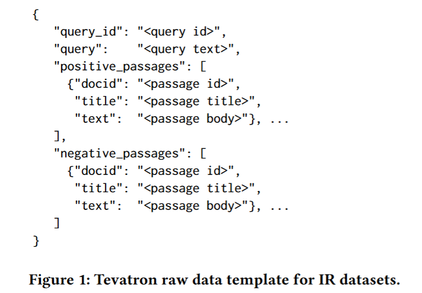
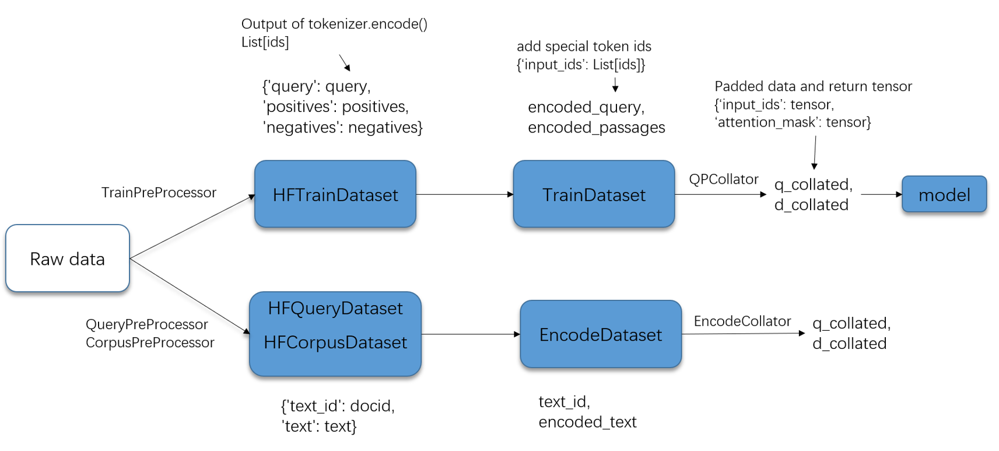

# Dive-into-Tevatron

"Dive-into-Tevatron" includes my learning notes on using Tevatron to reproduce a dense retrieval model, specifically the bi-encoder model on the MS-MARCO passage ranking dataset.


>
> Tevatron is a simple and efficient toolkit for training and running dense retrievers with deep language models. The toolkit has a modularized design for easy research; a set of command line tools are also provided for fast development and testing. A set of easy-to-use interfaces to Huggingface's state-of-the-art pre-trained transformers ensures Tevatron's superior performance.

For more information, please refer to the original repository: [texttron/tevatron: Tevatron - A flexible toolkit for dense retrieval research and development. (github.com)](https://github.com/texttron/tevatron)

# Installation

This section shows how to install the required libraries on Windows 10.

```
conda create -n tevatron python=3.7.0
git clone https://github.com/texttron/tevatron
cd tevatron
pip install --editable .
cd ..
# download torch-1.10.0+cu102-cp37-cp37m-win_amd64.whl
pip install torch-1.10.0+cu102-cp37-cp37m-win_amd64.whl
conda install -c conda-forge faiss-gpu
```

Assuming you are using Python 3.7.0, create an environment by running `conda create -n tevatron python=3.7.0`. And install Tevatron as an editable package for further development.

To install PyTorch (GPU version, CUDA 10.2, Python 3.7), download [cu102/torch-1.10.0%2Bcu102-cp37-cp37m-win_amd64.whl](https://download.pytorch.org/whl/cu102/torch-1.10.0%2Bcu102-cp37-cp37m-win_amd64.whl) from https://download.pytorch.org/whl/torch_stable.html and install it using `pip install xxx.whl`.

Tips: To verify your CUDA version, run `nvidia-smi`. It should be greater than 10.2.

# Run Script

To train bi-encoder model on MS MARCO passage ranking dataset ([Tevatron/msmarco-passage](https://huggingface.co/datasets/Tevatron/msmarco-passage)), see [examples in original repo](https://github.com/texttron/tevatron/blob/main/examples/example_msmarco.md).

# Code Analysis

In this section, I dive into code, add some comments and try to understand the logical relationship between classes, functions and files.

File structure:

```bash
│  arguments.py
│  data.py	# 'Data Management':`torch.utils.data.Dataset` object and collator for batch construction
│  loss.py
│  trainer.py
│  __init__.py
│
├─datasets
│  │  dataset.py	# 'Data Management': `datasets.Dataset` object; Load data and init preprocess method 
│  │  preprocessor.py	# 'Data Management': define preprocess (tokenization)
│  └─  __init__.py
│
├─distillation
│      arguments.py
│      data.py
│      trainer.py
│
├─driver
│      encode.py
│      jax_encode.py
│      jax_train.py
│      train.py
│      __init__.py
│
├─faiss_retriever
│      reducer.py
│      retriever.py
│      __init__.py
│      __main__.py
│
├─modeling
│  │  colbert.py
│  │  dense.py
│  │  encoder.py
│  │  splade.py
│  │  unicoil.py
│  └─ __init__.py
│
├─preprocessor
│      preprocessor_tsv.py
│      __init__.py
│
├─reranker
│      data.py
│      modeling.py
│      trainer.py
│      __init__.py
│
├─tevax
│      loss.py
│      training.py
│      __init__.py
│
└─utils
   │  convert_from_dpr.py
   │  __init__.py
   │
   └─format
           convert_result_to_marco.py
           convert_result_to_trec.py
           __init__.py
```


## Data Management

> Having data ready to use is a critical preliminary step before training or encoding starts. Data access overhead and constraints could directly affect training/encoding performance. In Tevatron, we adopt the following core design: 1) text data are **pre-tokenized before training or encoding** happens, 2) **keep tokenized data memory-mapped** instead of lazy-loaded or in-memory. The former avoids overheads when running sub-word/piece level tokenizers and also reduces data traffic compared to raw text. The latter allows random data access in the training/encoding loop without consuming a large amount of physical memory.

The input data format for IR task see figure below:



The construction method of Tevatron/msmarco-passage, see [get-data](https://github.com/texttron/tevatron/tree/main/examples/coCondenser-marco#get-data). This dataset contains 400,782 examples, with at least one positive passages and at most 30 negative passages.

Data management is mainly related to three files:

* datasets/preprocessor.py: Define the **preprocess (tokenization)** method of train dataset for training and query, corpus for encoding.
* datasets/dataset.py: Define class `HFTrainDataset` for training and `HFQueryDataset, HFCorpusDataset` for encoding (`datasets.Dataset` object).  **Load data and init preprocess method**.
* data.py: Define class `TrainDataset` and `EncodeDataset` (**construct `torch.utils.data.Dataset` object**). Define class `QPCollator` and `EncodeCollator` for **batch construction**.

The Figure below shows data stream (how data flows from class to class) and corresponding data format changes:

